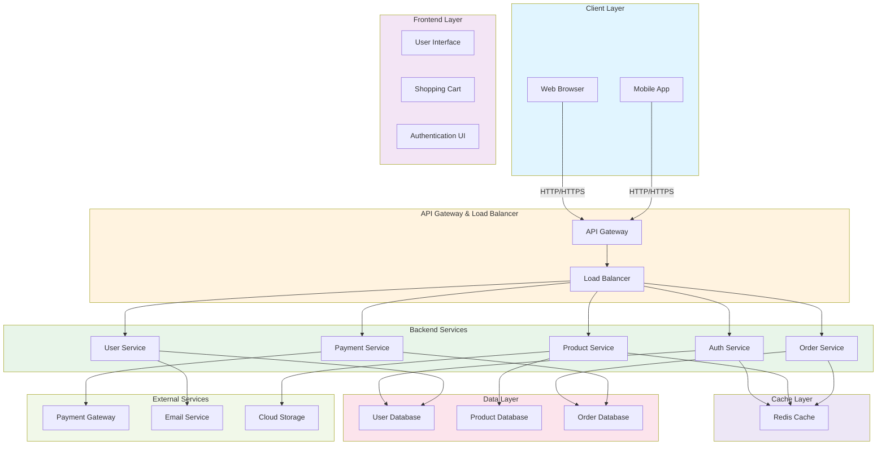

# Mini Shop - Architecture Overview

## System Architecture

## Components Description

### Client Layer
- **Web Browser**: Desktop/web access to mini shop
- **Mobile App**: Native mobile application for iOS and Android

### Frontend Layer
- **User Interface**: Product browsing, search, filtering
- **Shopping Cart**: Add/remove items, quantity management
- **Authentication UI**: Login, registration, profile management

### API Gateway & Load Balancer
- **API Gateway**: Central entry point, request routing, rate limiting
- **Load Balancer**: Distributes traffic across backend services

### Backend Services
- **Auth Service**: User authentication, JWT tokens, session management
- **Product Service**: Product catalog, inventory management, search
- **Order Service**: Order creation, order history, order tracking
- **Payment Service**: Payment processing, transaction management
- **User Service**: User profile, preferences, notifications

### Data Layer
- **User Database**: User accounts, profiles, passwords
- **Product Database**: Product details, categories, pricing
- **Order Database**: Orders, transactions, payment records

### Cache Layer
- **Redis Cache**: Session caching, product caching, cart caching

### External Services
- **Payment Gateway**: Stripe/PayPal integration
- **Email Service**: Order confirmations, notifications
- **Cloud Storage**: Product images, documents